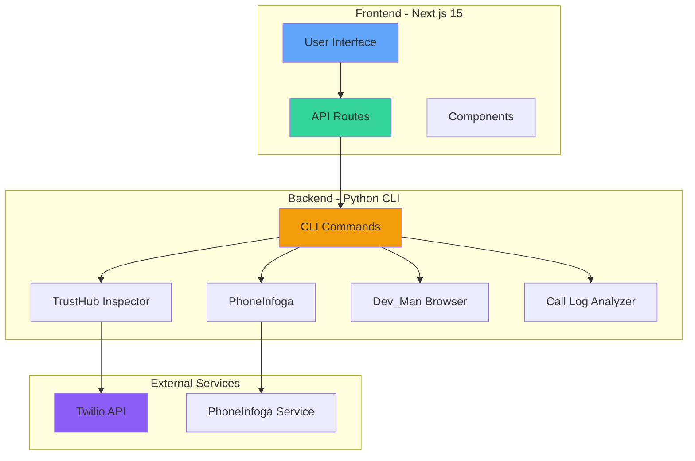
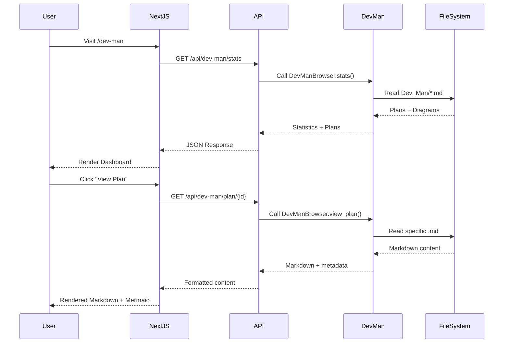

# Next.js Frontend Development Plan

**Status**: 📋 Planning
**Version**: 1.0.0
**Date**: 2025-10-02
**Estimated Effort**: 2-3 days

## 🎯 Overview

Build a modern Next.js 15 frontend for the Twilio CLI Tools that provides:
- Visual interface for all CLI functionality
- Interactive Dev_Man browser
- Real-time TrustHub management
- PhoneInfoga integration
- Dashboard with project stats and health metrics

**Reference Project**: `/Users/markcarpenter/Desktop/pete/pete-intercom-app`

## 📊 Current State Analysis

### Existing Backend (Python CLI)
- **26 CLI Commands** across 6 categories
- **TrustHub Inspector** - Customer profile management
- **PhoneInfoga** - Phone number analysis (Go-based)
- **Dev_Man Browser** - Project planning interface
- **Call Log Analysis** - CSV processing and visualization
- **Error Code Lookup** - Twilio error reference

### Tech Stack Learned from Reference
```json
{
  "framework": "Next.js 15 (Turbopack)",
  "ui": "Radix UI + Tailwind CSS 4",
  "charts": "Chart.js + react-chartjs-2",
  "diagrams": "Mermaid",
  "markdown": "marked",
  "forms": "react-hook-form + zod",
  "icons": "lucide-react"
}
```

## 🏗️ Architecture

### System Architecture



### Application Structure

```mermaid
graph LR
    subgraph "App Router"
        ROOT[/ Root]
        DASH[/dashboard]
        TH[/trusthub]
        DEV[/dev-man]
        PHONE[/phone-lookup]
        LOGS[/call-logs]
    end

    subgraph "API Routes"
        APITH[/api/trusthub]
        APIDM[/api/dev-man]
        APIPH[/api/phone]
        APICL[/api/call-logs]
    end

    ROOT --> DASH
    DASH --> TH
    DASH --> DEV
    DASH --> PHONE
    DASH --> LOGS

    TH --> APITH
    DEV --> APIDM
    PHONE --> APIPH
    LOGS --> APICL
```

### Dev_Man Integration Flow



## 📁 Project Structure

```
twilio-tools-nextjs/
├── src/
│   ├── app/
│   │   ├── (dashboard)/
│   │   │   ├── dashboard/
│   │   │   │   └── page.tsx          # Main dashboard
│   │   │   ├── trusthub/
│   │   │   │   ├── page.tsx          # TrustHub overview
│   │   │   │   ├── profiles/
│   │   │   │   │   └── [id]/
│   │   │   │   │       └── page.tsx  # Profile details
│   │   │   │   └── subaccounts/
│   │   │   │       └── page.tsx      # Subaccount management
│   │   │   ├── dev-man/
│   │   │   │   ├── page.tsx          # Dev_Man dashboard
│   │   │   │   ├── plans/
│   │   │   │   │   ├── page.tsx      # Plans list
│   │   │   │   │   └── [category]/
│   │   │   │   │       └── [id]/
│   │   │   │   │           └── page.tsx  # Plan viewer
│   │   │   │   └── diagrams/
│   │   │   │       └── page.tsx      # Diagram gallery
│   │   │   ├── phone-lookup/
│   │   │   │   └── page.tsx          # PhoneInfoga interface
│   │   │   └── call-logs/
│   │   │       └── page.tsx          # Call log analyzer
│   │   ├── api/
│   │   │   ├── trusthub/
│   │   │   │   ├── profiles/
│   │   │   │   │   └── route.ts
│   │   │   │   └── subaccounts/
│   │   │   │       └── route.ts
│   │   │   ├── dev-man/
│   │   │   │   ├── stats/
│   │   │   │   │   └── route.ts
│   │   │   │   ├── plans/
│   │   │   │   │   └── route.ts
│   │   │   │   └── search/
│   │   │   │       └── route.ts
│   │   │   ├── phone/
│   │   │   │   └── scan/
│   │   │   │       └── route.ts
│   │   │   └── call-logs/
│   │   │       └── route.ts
│   │   ├── layout.tsx
│   │   └── page.tsx                  # Landing/Login
│   ├── components/
│   │   ├── dashboard/
│   │   │   ├── StatCard.tsx
│   │   │   ├── QuickActions.tsx
│   │   │   └── RecentActivity.tsx
│   │   ├── trusthub/
│   │   │   ├── ProfileCard.tsx
│   │   │   ├── ProfileTable.tsx
│   │   │   ├── SubaccountList.tsx
│   │   │   └── StatusBadge.tsx
│   │   ├── dev-man/
│   │   │   ├── DevDashboard.tsx
│   │   │   ├── PlanBrowser.tsx
│   │   │   ├── PlanViewer.tsx
│   │   │   ├── MermaidRenderer.tsx
│   │   │   ├── StatsPanel.tsx
│   │   │   └── SearchBar.tsx
│   │   ├── phone/
│   │   │   ├── PhoneLookup.tsx
│   │   │   └── ResultsDisplay.tsx
│   │   ├── call-logs/
│   │   │   ├── LogUploader.tsx
│   │   │   ├── LogChart.tsx
│   │   │   └── LogTable.tsx
│   │   └── ui/
│   │       └── ... (shadcn components)
│   ├── lib/
│   │   ├── api/
│   │   │   ├── trusthub.ts
│   │   │   ├── devman.ts
│   │   │   ├── phone.ts
│   │   │   └── logs.ts
│   │   ├── python-bridge.ts         # Python CLI caller
│   │   └── utils.ts
│   └── types/
│       ├── trusthub.ts
│       ├── devman.ts
│       └── api.ts
├── public/
│   └── assets/
├── Dev_Man/                          # Existing planning docs
├── pyproject.toml                    # Python backend
├── src/twilio_cli/                  # Python CLI (existing)
├── package.json
├── next.config.ts
└── tailwind.config.ts
```

## 🎨 Key Features

### 1. Dev_Man Visual Browser

**Components**:
- **DevDashboard.tsx**: Main stats view with charts
- **PlanBrowser.tsx**: Tree view of completed/current/pending
- **PlanViewer.tsx**: Markdown renderer with Mermaid support
- **MermaidRenderer.tsx**: Interactive diagram viewer
- **StatsPanel.tsx**: Real-time project metrics

**Features**:
- 📊 Real-time stats (LOC, files, commands, completion %)
- 📋 Interactive plan browser with categories
- 🔍 Full-text search across all plans
- 📈 Mermaid diagram renderer
- 🎯 Progress tracking visualization

### 2. TrustHub Management Dashboard

**Components**:
- **ProfileTable.tsx**: Sortable, filterable profile list
- **ProfileCard.tsx**: Individual profile view
- **SubaccountList.tsx**: Hierarchical subaccount tree
- **StatusBadge.tsx**: Color-coded status indicators

**Features**:
- ✅ Profile health overview
- 🔍 Quick search by account number
- 📱 Subaccount management
- 🗑️ Profile deletion (with confirmation)
- 📊 A2P Brand/Campaign status

### 3. Dashboard Overview

**Metrics Displayed**:
```typescript
interface DashboardStats {
  trusthub: {
    totalProfiles: number;
    approved: number;
    pending: number;
    rejected: number;
  };
  development: {
    pythonFiles: number;
    linesOfCode: number;
    cliCommands: number;
    completionRate: number;
  };
  activity: {
    recentScans: PhoneScan[];
    recentLogs: CallLog[];
    recentChanges: DevManUpdate[];
  };
}
```

## 🔌 Python-Next.js Bridge

### API Route Pattern

```typescript
// src/app/api/dev-man/stats/route.ts
import { exec } from 'child_process';
import { promisify } from 'util';

const execAsync = promisify(exec);

export async function GET() {
  try {
    // Call Python CLI
    const { stdout } = await execAsync(
      'source .venv/bin/activate && python -c "from twilio_cli.dev_man_browser import DevManBrowser; import json; browser = DevManBrowser(); print(json.dumps(browser.stats))"'
    );

    const stats = JSON.parse(stdout);
    return Response.json(stats);
  } catch (error) {
    return Response.json({ error: error.message }, { status: 500 });
  }
}
```

### Alternative: REST API with FastAPI

**Optional enhancement**: Wrap Python CLI in FastAPI for better performance

```python
# src/twilio_cli/api_server.py
from fastapi import FastAPI
from twilio_cli.dev_man_browser import DevManBrowser

app = FastAPI()
browser = DevManBrowser()

@app.get("/api/dev-man/stats")
async def get_stats():
    return browser.stats

@app.get("/api/dev-man/plans/{category}")
async def get_plans(category: str):
    return browser.list_plans(category)
```

## 📝 Implementation Phases

### Phase 1: Foundation (Day 1)
- [ ] Initialize Next.js 15 project
- [ ] Set up Tailwind CSS 4
- [ ] Install shadcn/ui components
- [ ] Create base layout structure
- [ ] Implement Python bridge utility
- [ ] Create API route structure

### Phase 2: Dev_Man Interface (Day 1-2)
- [ ] Build DevDashboard component
- [ ] Implement PlanBrowser with tree view
- [ ] Create PlanViewer with markdown rendering
- [ ] Add Mermaid diagram support
- [ ] Implement search functionality
- [ ] Add stats visualization with charts

### Phase 3: TrustHub Dashboard (Day 2)
- [ ] Create ProfileTable component
- [ ] Build ProfileCard detail view
- [ ] Implement SubaccountList
- [ ] Add search and filter functionality
- [ ] Create health check view

### Phase 4: Additional Features (Day 2-3)
- [ ] PhoneInfoga lookup interface
- [ ] Call log uploader and analyzer
- [ ] Error code lookup
- [ ] Quick actions panel

### Phase 5: Polish & Deploy (Day 3)
- [ ] Responsive design refinement
- [ ] Loading states and error handling
- [ ] Performance optimization
- [ ] Documentation
- [ ] Deployment setup

## 🎯 Success Criteria

- ✅ All 26 CLI commands accessible via UI
- ✅ Dev_Man browser fully functional with diagrams
- ✅ Real-time stats matching CLI output
- ✅ Responsive design (mobile, tablet, desktop)
- ✅ < 2s page load time
- ✅ Mermaid diagrams render correctly
- ✅ Search works across all content
- ✅ Python CLI integration seamless

## 📚 Reference Patterns from pete-intercom-app

### Key Learnings
1. **Turbopack** for faster dev builds
2. **Radix UI** for accessible components
3. **Mermaid** for diagram rendering
4. **App Router** structure with route groups
5. **API Routes** for backend integration
6. **Markdown rendering** with `marked`
7. **Chart.js** for data visualization

### Patterns to Adopt
- Route groups for dashboard: `(dashboard)/`
- API routes: `/api/[feature]/[action]`
- Component structure: `components/[feature]/[Component].tsx`
- Type definitions: `types/[feature].ts`
- Lib utilities: `lib/[feature].ts`

### Patterns to Avoid
- Don't copy authentication (Clerk-specific)
- Don't copy LangChain integration (not needed)
- Don't copy email functionality (not needed)

## 🚀 Getting Started

```bash
# 1. Create Next.js app in twilio project
cd /Users/markcarpenter/Desktop/pete/twilio
npx create-next-app@latest twilio-web --typescript --tailwind --app

# 2. Install dependencies
cd twilio-web
npm install @radix-ui/react-slot @radix-ui/react-tabs @radix-ui/react-progress
npm install chart.js react-chartjs-2 mermaid marked lucide-react
npm install class-variance-authority clsx tailwind-merge

# 3. Set up shadcn/ui
npx shadcn@latest init

# 4. Start development
npm run dev
```

## 📋 Next Steps

1. **Review this plan** with team/stakeholders
2. **Set up project** following structure above
3. **Build Phase 1** - Foundation
4. **Iterate** on Dev_Man interface
5. **Expand** to other features
6. **Deploy** and gather feedback

## 🔗 References

- Next.js 15 Docs: https://nextjs.org/docs
- Radix UI: https://www.radix-ui.com/
- Mermaid: https://mermaid.js.org/
- Tailwind CSS 4: https://tailwindcss.com/
- Reference Project: `/Users/markcarpenter/Desktop/pete/pete-intercom-app`
