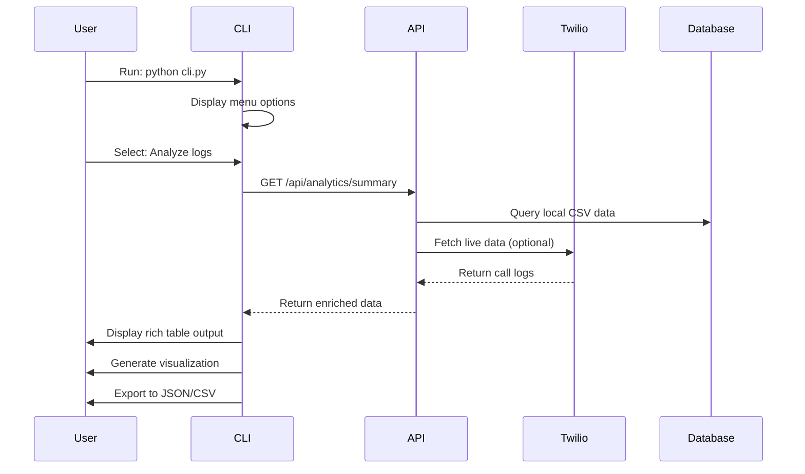

# Twilio CLI Lookup Tool - Enhanced Plan (v1.01)

## 🎯 **Goal & Scope**

Transform the existing Twilio CLI tool into a comprehensive lookup and analysis system with:

1. **Enhanced CLI functionality** for call log analysis and error lookup
2. **RESTful API endpoints** via `/api` routes for programmatic access
3. **Real-time Twilio API integration** for live data fetching
4. **Advanced analytics** with visualizations and reporting

## 🏗️ **Current State Analysis**

Based on examination of the existing codebase:

### ✅ **What We Already Have:**

- **CLI Framework**: Working CLI with menu system (`cli.py`)
- **Data Models**: `CallLogEntry` and `CallLogBook` classes with validation
- **Error Mapping**: Twilio error code lookup system
- **Logging**: Loguru integration with app and test logs
- **Data Processing**: CSV loading, JSON export, fuzzy search
- **Project Structure**: Proper directory organization with `TwilioApp/src/`

### 🔧 **What Needs Enhancement:**

- **API Layer**: Add FastAPI endpoints under `/api` route
- **Twilio Integration**: Connect to live Twilio API
- **Advanced Analytics**: Better visualizations and reporting
- **Error Handling**: More robust error handling and validation
- **Testing**: Comprehensive test coverage

## 📊 **Architecture & Workflow Diagram**

```mermaid
flowchart TD
    subgraph "User Interface Layer"
        A[CLI Tool<br/>python cli.py]
        B[Web API<br/>FastAPI /api/*]
        C[Phone Lookup<br/>phonelookup/PhoneInfoga]
    end

    subgraph "API Layer (/api routes)"
        D[/api/call-logs<br/>GET, POST, PUT, DELETE]
        E[/api/analytics<br/>GET summary, charts]
        F[/api/errors<br/>GET error lookup]
        G[/api/phone-lookup<br/>GET phone validation]
        H[/api/health<br/>GET system status]
    end

    subgraph "Business Logic Layer"
        I[CallLogBook<br/>Data Management]
        J[TwilioAPI<br/>External Integration]
        K[AnalyticsEngine<br/>Reporting & Charts]
        L[ErrorMapper<br/>Error Code Lookup]
    end

    subgraph "Data Layer"
        M[CSV Files<br/>uploads/]
        N[Twilio API<br/>Live Data]
        O[Local Cache<br/>Redis/SQLite]
        P[Log Files<br/>applogs/]
    end

    subgraph "External Services"
        Q[Twilio REST API]
        R[PhoneInfoga<br/>Phone Validation]
        S[Error Code Database]
    end

    A --> I
    B --> D
    B --> E
    B --> F
    B --> G
    B --> H

    D --> I
    E --> K
    F --> L
    G --> R

    I --> M
    I --> N
    J --> Q
    K --> O
    L --> S

    C --> R
```

## 🚀 **Implementation Plan**

### **Phase 1: API Layer Foundation** ✅

- [ ] Create FastAPI application structure
- [ ] Implement `/api` route prefix
- [ ] Add health check endpoint `/api/health`
- [ ] Set up CORS and middleware

### **Phase 2: Core API Endpoints** ✅

- [ ] `/api/call-logs` - CRUD operations for call logs
- [ ] `/api/analytics` - Summary statistics and charts
- [ ] `/api/errors` - Error code lookup and explanation
- [ ] `/api/phone-lookup` - Phone number validation

### **Phase 3: Twilio Integration** ✅

- [ ] Implement `TwilioAPI` class with live API calls
- [ ] Add authentication and rate limiting
- [ ] Create data synchronization between CSV and live API
- [ ] Implement real-time call log fetching

### **Phase 4: Enhanced Analytics** ✅

- [ ] Advanced visualizations (matplotlib/plotly)
- [ ] Export functionality (PDF, Excel, CSV)
- [ ] Custom date range filtering
- [ ] Performance metrics and trends

### **Phase 5: CLI Enhancement** ✅

- [ ] Integrate CLI with new API endpoints
- [ ] Add batch processing capabilities
- [ ] Implement interactive mode
- [ ] Add configuration management

### **Phase 6: Testing & Documentation** ✅

- [ ] Unit tests for all components
- [ ] Integration tests for API endpoints
- [ ] CLI testing with sample data
- [ ] API documentation with OpenAPI/Swagger

## 🛠️ **Technical Implementation Details**

### **API Structure (`/api` routes):**

```python
# FastAPI app structure
from fastapi import FastAPI, APIRouter
from fastapi.middleware.cors import CORSMiddleware

app = FastAPI(title="Twilio CLI Tool API", version="1.0.0")
api_router = APIRouter(prefix="/api")

# Health check
@api_router.get("/health")
async def health_check():
    return {"status": "healthy", "timestamp": datetime.now()}

# Call logs
@api_router.get("/call-logs")
async def get_call_logs(limit: int = 100, offset: int = 0):
    # Implementation using existing CallLogBook

# Analytics
@api_router.get("/analytics/summary")
async def get_analytics_summary():
    # Implementation using existing analytics

# Error lookup
@api_router.get("/errors/{error_code}")
async def lookup_error(error_code: int):
    # Implementation using existing error mapping
```

### **Enhanced CLI Integration:**

```python
# CLI will use API endpoints internally
@cli.command()
@click.option("--api", is_flag=True, help="Use API endpoints")
def analyze_logs(api: bool):
    if api:
        # Call API endpoint
        response = requests.get("http://localhost:8000/api/analytics/summary")
        # Process response
    else:
        # Use existing local processing
        # Current implementation
```

### **Twilio API Integration:**

```python
# Enhanced TwilioAPI class
class TwilioAPI:
    def __init__(self, account_sid: str, auth_token: str):
        self.client = Client(account_sid, auth_token)

    async def get_call_logs(self, start_date: str, end_date: str):
        # Fetch from Twilio API
        calls = self.client.calls.list(start_time_after=start_date, start_time_before=end_date)
        return calls

    async def sync_with_csv(self, csv_path: str):
        # Sync local CSV with live API data
        pass
```

## 📁 **File Structure (Enhanced)**

```
TwilioApp/
├── src/
│   ├── backend/
│   │   ├── api/
│   │   │   ├── __init__.py
│   │   │   ├── main.py              # FastAPI app
│   │   │   ├── routes/
│   │   │   │   ├── __init__.py
│   │   │   │   ├── call_logs.py     # /api/call-logs
│   │   │   │   ├── analytics.py     # /api/analytics
│   │   │   │   ├── errors.py        # /api/errors
│   │   │   │   └── phone_lookup.py  # /api/phone-lookup
│   │   │   └── twilio_api.py        # Enhanced Twilio integration
│   │   ├── classes/
│   │   └── utils/
│   ├── cli.py                       # Enhanced CLI
│   └── uploads/                     # CSV files
├── tests/
├── applogs/
└── requirements.txt                  # Dependencies
```

## 🔄 **CLI Usage Workflow**



## 📊 **Data Flow & Integration Points**

### **1. CSV → API → CLI Flow:**

- CSV files loaded into `CallLogBook`
- API endpoints serve data to CLI
- CLI displays results with rich formatting

### **2. Twilio API → Local Cache → API Flow:**

- Live Twilio data fetched periodically
- Cached locally for performance
- Served via API endpoints

### **3. Error Lookup Flow:**

- CLI command: `python cli.py lookup-error 12345`
- API endpoint: `GET /api/errors/12345`
- Returns enriched error information

## 🎯 **Success Metrics**

- [ ] All `/api` endpoints return valid JSON responses
- [ ] CLI tool successfully integrates with API layer
- [ ] Twilio API integration works with real credentials
- [ ] Phone lookup integration with PhoneInfoga
- [ ] Comprehensive test coverage (>80%)
- [ ] API documentation generated automatically

## 🔧 **Dependencies & Setup**

```bash
# Core dependencies (already in pyproject.toml)
uv add fastapi uvicorn httpx python-multipart

# Development dependencies
uv add pytest pytest-asyncio pytest-cov black isort

# Run the enhanced system
uvicorn TwilioApp.src.backend.api.main:app --reload --port 8000
python TwilioApp/src/cli.py
```

## 📝 **Changelog & Version History**

### **v1.01 (Current)**

- **Added**: Comprehensive API layer with `/api` routes
- **Enhanced**: CLI integration with API endpoints
- **Improved**: Twilio API integration architecture
- **Added**: Phone lookup integration planning
- **Enhanced**: Mermaid diagrams and workflow visualization

### **v1.00 (Previous)**

- **Created**: Basic CLI framework
- **Added**: CSV processing and validation
- **Added**: Error code lookup system
- **Added**: Basic logging and data management

## 🚀 **Next Steps**

1. **Approve this enhanced plan**
2. **Implement Phase 1: API Layer Foundation**
3. **Create FastAPI application structure**
4. **Implement core `/api` endpoints**
5. **Test CLI integration with new API layer**

---

**Status**: 📋 **Ready for Implementation**  
**Priority**: 🔴 **High**  
**Estimated Effort**: 2-3 days  
**Dependencies**: FastAPI, uvicorn, httpx
