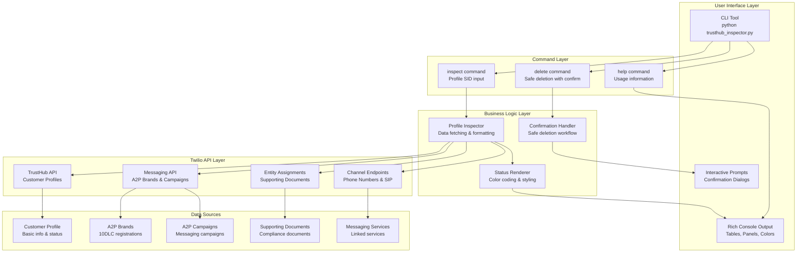
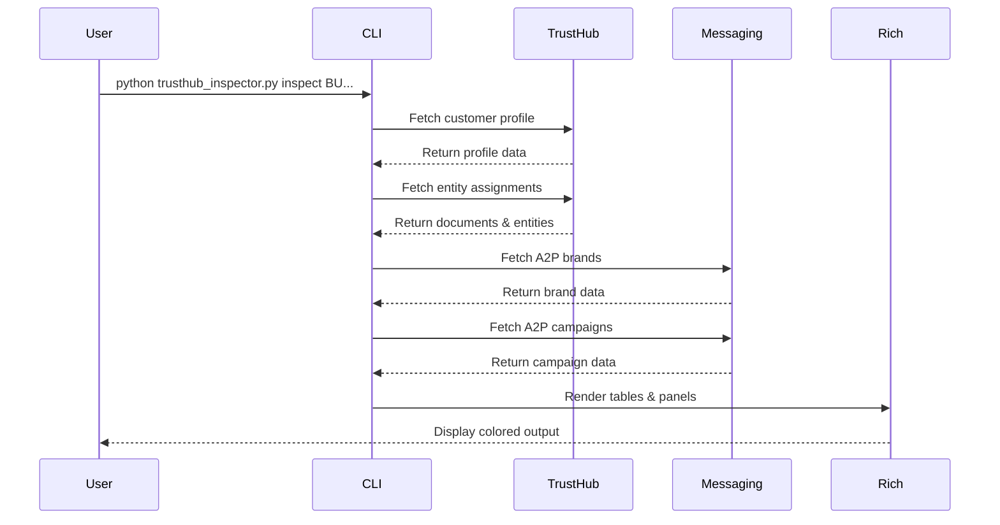

# Twilio TrustHub Inspector - Implementation Plan (v1.00)

## 🎯 **Goal & Scope**

Build a comprehensive CLI tool for inspecting and managing Twilio TrustHub customer profiles with:

1. **Profile Inspection**: View all TrustHub details, 10DLC status, and messaging campaign status
2. **Rich CLI Interface**: Beautiful terminal UI using click + rich with color coding
3. **TrustHub Integration**: Full access to TrustHub APIs for customer profiles, supporting documents, and compliance
4. **A2P 10DLC Management**: View brand registrations and campaign statuses
5. **Profile Management**: Safe deletion with confirmation prompts

## 🏗️ **Current State Analysis**

Based on the requirements from the pending plan:

### ✅ **What We Need to Build:**

- **TrustHub Inspector CLI**: Main application with click commands
- **Rich UI Components**: Tables, panels, and color-coded status displays
- **Twilio API Integration**: TrustHub, Messaging, and Regulatory APIs
- **Environment Configuration**: .env file support for credentials
- **Error Handling**: Robust error handling with user-friendly messages

### 🔧 **Key Features Required:**

- **Profile Inspection**: `inspect <profile_sid>` command
- **Profile Deletion**: `delete <profile_sid>` command with confirmation
- **A2P Brand/Campaign Status**: View 10DLC registration status
- **Supporting Documents**: View all linked documents and entities
- **Messaging Services**: View linked messaging services
- **Color-Coded Status**: Green (approved), Yellow (pending), Red (rejected)

## 📊 **Architecture & Workflow Diagram**



## 🚀 **Implementation Plan**

### **Phase 1: Foundation & Setup** ✅

- [ ] Create project structure and dependencies
- [ ] Set up .env configuration for Twilio credentials
- [ ] Install required packages (twilio, python-dotenv, click, rich)
- [ ] Create basic CLI framework with click

### **Phase 2: Core TrustHub Integration** ✅

- [ ] Implement `fetch_customer_profile()` function
- [ ] Implement `list_customer_entity_assignments()` function
- [ ] Implement `list_channel_endpoint_assignments()` function
- [ ] Implement `list_supporting_documents()` function
- [ ] Add error handling and validation

### **Phase 3: A2P 10DLC Integration** ✅

- [ ] Implement `list_a2p_brands()` function
- [ ] Implement `list_a2p_campaigns()` function
- [ ] Implement `list_messaging_services()` function
- [ ] Add filtering by customer profile SID
- [ ] Handle API field variations and edge cases

### **Phase 4: Rich UI Components** ✅

- [ ] Create `render_profile_table()` with rich panels
- [ ] Create `render_entity_assignments()` with rich tables
- [ ] Create `render_brand_table()` with A2P information
- [ ] Create `render_campaign_table()` with campaign status
- [ ] Implement color-coded status styling

### **Phase 5: CLI Commands** ✅

- [ ] Implement `@cli.command()` for inspect
- [ ] Implement `@cli.command()` for delete
- [ ] Add interactive profile SID input
- [ ] Add confirmation prompts for deletion
- [ ] Add help and usage information

### **Phase 6: Testing & Polish** ✅

- [ ] Test with real Twilio credentials
- [ ] Validate all API endpoints work correctly
- [ ] Test error handling scenarios
- [ ] Add usage examples and documentation
- [ ] Performance optimization for large datasets

## 🛠️ **Technical Implementation Details**

### **Project Structure:**

```
TwilioApp/
├── src/
│   ├── trusthub_inspector/
│   │   ├── __init__.py
│   │   ├── main.py              # Main CLI application
│   │   ├── api/
│   │   │   ├── __init__.py
│   │   │   ├── trusthub.py      # TrustHub API functions
│   │   │   ├── messaging.py     # Messaging API functions
│   │   │   └── entities.py      # Entity assignment functions
│   │   ├── ui/
│   │   │   ├── __init__.py
│   │   │   ├── renderers.py     # Rich UI components
│   │   │   └── status.py        # Status styling and colors
│   │   └── utils/
│   │       ├── __init__.py
│   │       ├── config.py        # Environment configuration
│   │       └── validation.py    # Input validation
│   └── .env                     # Twilio credentials
├── tests/
│   └── test_trusthub_inspector/
├── requirements.txt
└── README.md
```

### **Core Dependencies:**

```toml
[project]
dependencies = [
    "twilio>=8.0.0",
    "python-dotenv>=1.0.0",
    "click>=8.0.0",
    "rich>=13.0.0"
]

[project.optional-dependencies]
dev = [
    "pytest>=7.0.0",
    "pytest-asyncio>=0.21.0",
    "black>=23.0.0",
    "isort>=5.12.0"
]
```

### **Environment Configuration (.env):**

```bash
# Twilio credentials
TWILIO_ACCOUNT_SID=ACxxxxxxxxxxxxxxxxxxxxxxxxxxxxxxxx
TWILIO_AUTH_TOKEN=your_auth_token_here

# Optional: API limits and timeouts
TWILIO_API_LIMIT=200
TWILIO_TIMEOUT=30
```

### **Main CLI Structure:**

```python
@click.group()
def cli():
    """TrustHub Inspector — inspect Twilio TrustHub customer profiles and related compliance objects"""
    pass

@cli.command()
@click.argument("profile_sid", required=False)
def inspect(profile_sid):
    """Inspect a TrustHub customer profile. If PROFILE_SID is not provided, you'll be prompted."""
    # Implementation

@cli.command()
@click.argument("profile_sid", required=False)
def delete(profile_sid):
    """Delete the customer profile permanently (irreversible)."""
    # Implementation
```

## 🎨 **Rich UI Components**

### **Status Color Coding:**

```python
def status_style(val):
    """Apply color coding to status values."""
    if not val:
        return "[yellow]unknown[/yellow]"
    v = str(val).upper()
    if v in ("APPROVED", "ACTIVE", "REGISTERED", "COMPLETED"):
        return f"[green]{v}[/green]"
    if v in ("PENDING", "IN_REVIEW", "SUBMITTED"):
        return f"[yellow]{v}[/yellow]"
    if v in ("FAILED", "REJECTED", "DENIED", "SUSPENDED"):
        return f"[red]{v}[/red]"
    return f"[white]{v}[/white]"
```

### **Rich Table Rendering:**

```python
def render_profile_table(profile):
    """Render customer profile information in a rich table."""
    t = Table.grid(expand=True)
    t.add_column(justify="right", ratio=30)
    t.add_column(ratio=70)
    t.add_row("[cyan]SID[/cyan]", f"[bold]{profile.sid}[/bold]")
    t.add_row("[cyan]Friendly Name[/cyan]", profile.friendly_name or "[i]N/A[/i]")
    t.add_row("[cyan]Status[/cyan]", status_style(profile.status))
    return Panel(t, title="Customer Profile", border_style="bright_blue", box=box.ROUNDED)
```

## 🔄 **Usage Workflow**



## 📊 **Data Flow & API Integration**

### **1. Profile Inspection Flow:**

- User provides Customer Profile SID
- CLI fetches profile from TrustHub API
- CLI fetches related entities (documents, endpoints)
- CLI fetches A2P brands and campaigns
- CLI renders all data in rich tables

### **2. Profile Deletion Flow:**

- User provides Customer Profile SID
- CLI fetches profile details for confirmation
- CLI displays profile information
- CLI prompts for confirmation ("Type 'YES'")
- CLI deletes profile if confirmed

### **3. API Endpoints Used:**

- `GET /v1/CustomerProfiles/{Sid}` - Profile details
- `GET /v1/CustomerProfiles/{Sid}/EntityAssignments` - Supporting documents
- `GET /v1/CustomerProfiles/{Sid}/ChannelEndpointAssignments` - Phone numbers
- `GET /v1/BrandRegistrations` - A2P brand status
- `GET /v1/CampaignRegistrations` - A2P campaign status
- `GET /v1/Services` - Messaging services

## 🎯 **Success Metrics**

- [ ] CLI tool successfully connects to Twilio APIs
- [ ] All TrustHub data is displayed correctly
- [ ] A2P brand and campaign status is accurate
- [ ] Profile deletion works with confirmation
- [ ] Rich UI renders beautifully with colors
- [ ] Error handling works for invalid SIDs
- [ ] Tool handles large datasets efficiently

## 🔧 **Setup & Installation**

```bash
# Install dependencies
uv add twilio python-dotenv click rich

# Create .env file
echo "TWILIO_ACCOUNT_SID=ACxxxxxxxxxxxxxxxxxxxxxxxxxxxxxxxx" > .env
echo "TWILIO_AUTH_TOKEN=your_auth_token_here" >> .env

# Run the inspector
python trusthub_inspector.py inspect BUc581a87abdd01affc47a0aeb813541f3
```

## 📝 **Changelog & Version History**

### **v1.00 (Current)**

- **Created**: Comprehensive implementation plan
- **Planned**: TrustHub Inspector CLI tool
- **Planned**: Rich UI with color-coded status
- **Planned**: Full TrustHub API integration
- **Planned**: A2P 10DLC management
- **Planned**: Safe profile deletion workflow

## 🚀 **Next Steps**

1. **Approve this implementation plan**
2. **Start with Phase 1: Foundation & Setup**
3. **Create project structure and install dependencies**
4. **Implement basic CLI framework**
5. **Add TrustHub API integration**

---

**Status**: 📋 **Ready for Implementation**  
**Priority**: 🔴 **High**  
**Estimated Effort**: 1-2 days  
**Dependencies**: twilio, python-dotenv, click, rich
