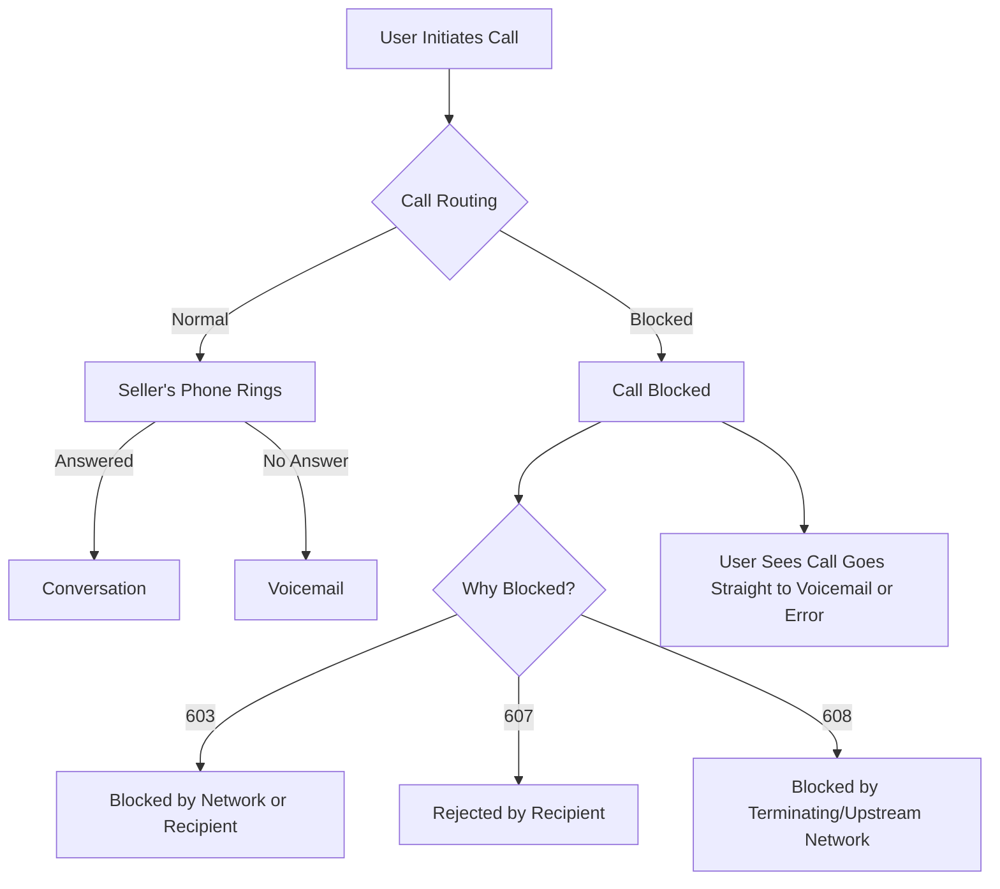

**client_ticket:** [Intercom Conversation](https://app.intercom.com/a/inbox/ql8el0gn/inbox/shared/all/conversation/215469108439785?view=List)

---

**16h**  
_This is an Auto Reply 🕕_  
Thank you for your message. We're currently out of the office, but we'll get back to you the first thing in the morning.

---

**16h**  
**S:**  
I have a question. I spoke with the seller a few times over the phone, but now when I try to call again, the phone goes straight to voicemail and the screen looks like that.  
Do you think they might have blocked my number?

**Ticket Status:** Support WorkFlow - Re-opened

---

**16h**  
**Mark Carpenter:**  
we'll hit this one in the morning. I know it's early, but I want to see where your mind goes on how to identify/handle this conversation.

---

**16h**  
**Jon Nolen:**  
This does not seem like a CRM issue to me this seems like a new investor who has not made very many sales calls lol. I would like to dig into the <!> error because not familiar yet with the error indications. but i would assume this is more user education on what is a issue and what is not. My response {

> Hey thanks for reaching out Is this a isolated case are you seeing this error across multiple conversations , or just the one ? You are probably correct in that the seller may have blocked you or number got turned off or disconnected.

}

---

**6h**

---

### SIP Codes for Call Blocking Scenarios: 603, 607, and 608

You may have noticed an increase in the appearance of certain response codes in failed call attempts, and wondered, "What do these new codes mean?"

In the SIP protocol, response codes are used to convey the status or outcome of a SIP Invite back to the SIP client originating the call. When a call attempt fails, the SIP response code explains the reason the call failed.

Three codes are being used more frequently to give you more insight into failed call attempts. The increased frequency does not mean calls are failing more often. There is no decrease in call completion rate due to this change. The change is only to provide more granular visibility into why calls did not complete.

Due to the large volume of calls that are spam or fraud, the major wireless networks use analytic engines to identify—and in some cases, block—suspicious traffic. Unfortunately, the analytic engines sometimes flag legitimate traffic causing those calls to be inappropriately blocked.

If a voice network blocks a call based on analytics, the blocking network returns one of three SIP response codes:

| SIP Response Code | Explanation                                                                                           |
| ----------------- | ----------------------------------------------------------------------------------------------------- |
| 603               | General-purpose code that could mean the call was blocked by a voice network or by the call recipient |
| 607               | The call recipient did not want the call and rejected it                                              |
| 608               | The call was blocked by the terminating voice network or an upstream network                          |

---

## 🛠️ Educational Summary: What Was the Problem?

**Problem:**

- The user tried to call a seller multiple times, but the calls now go straight to voicemail.
- This could be due to:
  - The seller blocking the user's number
  - The seller's phone being turned off or disconnected
  - The call being blocked by a network (possibly flagged as spam or unwanted)

**How to Identify:**

- Check if this issue occurs with other numbers or just this one.
- Look for SIP response codes (603, 607, 608) in call logs for more details.

**What Do the SIP Codes Mean?**

- **603:** Call blocked by network or recipient
- **607:** Call rejected by recipient
- **608:** Call blocked by terminating or upstream network

---

## 📈 Call Flow & Blocking: Visualized

---

> **Tip:** If you see your calls going straight to voicemail and/or receive SIP codes 603, 607, or 608, it's likely your number is being blocked or filtered by the recipient or their network. Try calling from a different number or contact the recipient through another channel to confirm.
